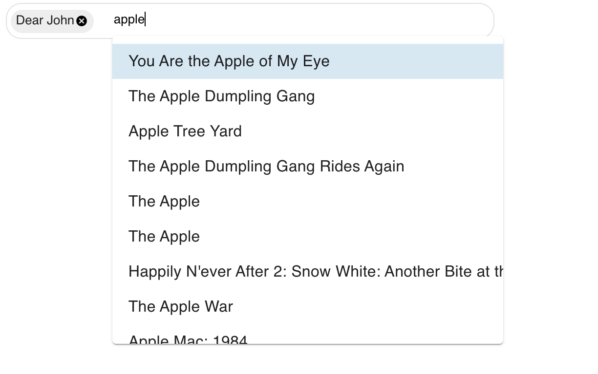

# Movie title autocomplete React component

### Entry Component:

### /src/components/movieTitleAutocomplete



### How to run

```
npm i
npm start
```

### Assumptions and tradeoffs

- If the movie is already selected as a pill, selecting it again will remove it from the component.
- After user select a movie, the text input box will be cleared and the input box will still be focused.
- The time delay between the moment user stop typing and the API requesting: 500ms.
- The way it handles overflow: The pills will take up to 50% of the autocomplete box; after that it will auto scroll to the left. The input box on the right has a flex length with default overflow control.
